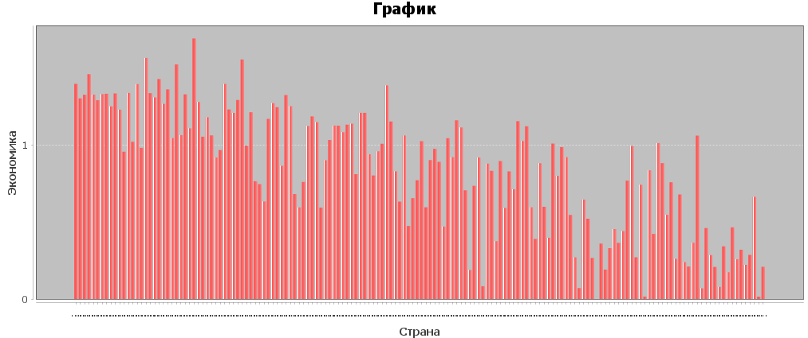
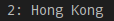
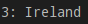

# Проект Java

Парсер состоит из одной простой статичной функции.

В бд создана только одна таблица, так как данные в csv-файле уже соответствуют 3-ей нормальной форме.

Получение и оформление всех данных происходит в классе Main.

## Задания

### Задание 1

### Задание 2

### Задание 3

